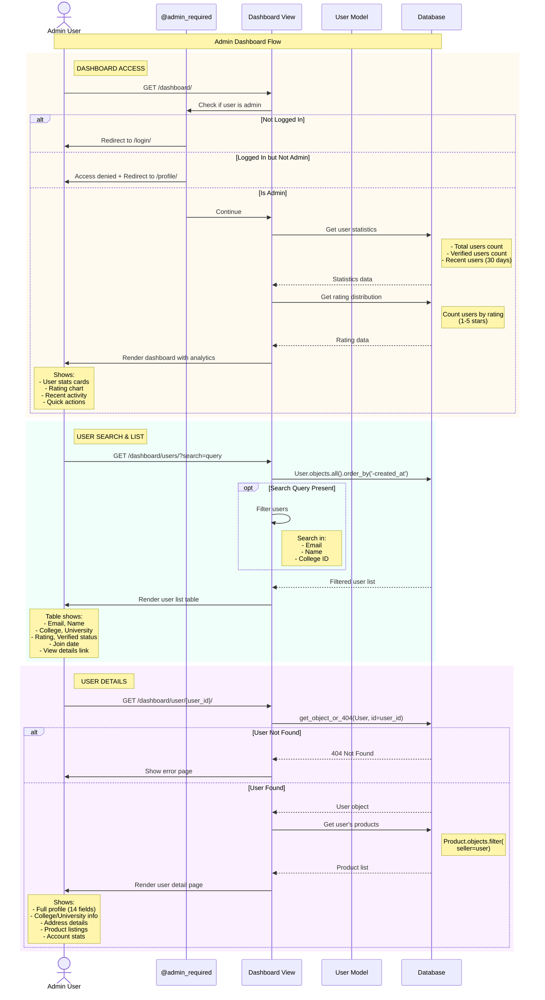

# Admin Dashboard Sequence Diagram

## Overview
This sequence diagram shows the admin dashboard workflow, including authentication checks, user statistics, search functionality, and user detail views.

## Sequence Diagram

## Flow Description

### Actors and Participants

1. **Admin User** - Authenticated admin accessing dashboard
2. **@admin_required** - Custom decorator enforcing admin access
3. **Dashboard View** - Views handling admin operations
4. **User Model** - Django model for user data
5. **Database** - SQLite database

### Main Flows

**Dashboard Access**
- Admin decorator checks authentication and admin status
- Retrieves statistics: total users, verified users, recent signups
- Calculates rating distribution
- Displays analytics dashboard

**User Search**
- Lists all users with search capability
- Filters by email, name, or college ID
- Shows table with key user information
- Ordered by most recent first

**User Details**
- View complete user profile (all 14 fields)
- See user's product listings
- View verification status and ratings

## Key Features

- **Role-Based Access**: Only admin users allowed
- **Analytics Dashboard**: Real-time user statistics
- **Search Functionality**: Quick user lookup
- **Complete User View**: All profile fields visible
- **Security**: Access control via decorators

## Related Files

- [dashboard/views.py](file:///d:/projects/mini%20project/dashboard/views.py) - Admin views
- [registration/models.py](file:///d:/projects/mini%20project/registration/models.py) - User model
