# Borrow Request Sequence Diagram

## Overview
This sequence diagram illustrates the complete borrow/lend workflow in the Student Resource Exchange, including request creation, approval, OTP-based verification (similar to Uber), and return process.

## Sequence Diagram

```mermaid
sequenceDiagram
    actor Borrower as Borrower (Browser)
    actor Lender as Lender (Browser)
    participant BView as Borrow Request View
    participant LView as Lender View
    participant Model as BorrowRequest Model
    participant OTP as OTP Utils
    participant Chat as Chat System
    participant Product as Product Model
    participant Cache as Django Cache
    participant DB as Database

    Note over Borrower,DB: Borrow Request Flow

    rect rgb(240, 255, 240)
        Note right of Borrower: PHASE 1: CREATE REQUEST
        
        Borrower->>BView: GET /products/{id}/borrow-request/
        
        BView->>DB: Get Product by ID
        DB-->>BView: Product object
        
        BView->>BView: Validate borrowing eligibility
        Note right of BView: Checks:<br/>- can_be_borrowed()<br/>- Not own product<br/>- No pending/active request
        
        alt Not Eligible
            BView->>Borrower: Error message + Redirect
        else Eligible
            BView->>Borrower: Show borrow request form
        end
        
        Borrower->>BView: POST form (requested_days, message)
        
        BView->>BView: Calculate total cost
        Note right of BView: cost = borrow_price_per_day<br/>× requested_days
        
        BView->>Model: Create BorrowRequest
        Note right of Model: Status: 'pending'<br/>Total cost calculated<br/>Deposit amount set
        
        Model->>DB: INSERT INTO borrow_requests
        DB-->>Model: Request created with ID
        
        BView->>Cache: Invalidate lender's pending count
        Note right of Cache: cache.delete(key)
        
        BView->>Borrower: Success + Redirect to request detail
    end

    rect rgb(255, 240, 240)
        Note right of Lender: PHASE 2: LENDER APPROVAL
        
        Lender->>LView: GET /products/my-lend-requests/
        
        LView->>DB: Get pending requests for lender
        Note right of DB: BorrowRequest.objects.filter(<br/>lender=user, status='pending')
        
        DB-->>LView: List of pending requests
        LView->>Lender: Display lending dashboard
        
        Lender->>LView: Click "Approve" → POST /approve/{request_id}/
        
        LView->>Model: Update status to 'approved'
        LView->>Model: Set approved_date = now()
        LView->>Model: Set lender_response message
        
        LView->>OTP: create_acceptance_otp(request)
        Note right of OTP: Generate 6-digit OTP<br/>Valid for 15 minutes
        
        OTP->>DB: Save OTP record
        
        OTP->>Chat: send_otp_notification()
        Note right of Chat: Send via chat to borrower:<br/>"Your request approved!<br/>OTP: {code}"
        
        LView->>Cache: Invalidate pending count
        LView->>Lender: Success message with OTP
        Note over Lender: "Request approved!<br/>OTP sent to borrower."
    end

    rect rgb(240, 240, 255)
        Note right of Borrower: PHASE 3: ITEM PICKUP (OTP VERIFICATION)
        
        Borrower->>Borrower: Meets lender to pickup item
        Note over Borrower,Lender: In-person meeting
        
        Lender->>LView: GET /verify-acceptance-otp/{request_id}/
        LView->>Lender: Show OTP verification form
        
        Borrower->>Lender: Shows OTP code
        Note over Borrower,Lender: Borrower displays OTP<br/>from chat notification
        
        Lender->>LView: POST verify (otp_code)
        
        LView->>OTP: verify_otp(request, 'acceptance', code)
        
        OTP->>DB: Get OTP record
        
        alt OTP Invalid/Expired
            OTP-->>LView: Verification failed
            LView->>Lender: Error message
        else OTP Valid
            OTP-->>LView: Verification success
            
            LView->>Model: Update request
            Note right of Model: - status = 'active'<br/>- acceptance_otp_verified = True<br/>- start_date = today<br/>- expected_return_date = <br/>  today + requested_days
            
            LView->>Product: Set is_currently_borrowed = True
            Product->>DB: UPDATE products
            
            LView->>Lender: Success message
            Note over Lender: "Item handover confirmed!<br/>Borrowing period started."
            
            Note over Borrower: Item borrowed successfully
        end
    end

    rect rgb(255, 255, 240)
        Note right of Borrower: PHASE 4: ITEM RETURN
        
        Borrower->>BView: Generate return OTP
        Note over Borrower: When ready to return
        
        BView->>OTP: create_return_otp(request)
        OTP->>DB: Save return OTP
        OTP->>Chat: Notify lender with OTP
        
        Borrower->>Borrower: Meets lender to return item
        
        Lender->>LView: GET /verify-return-otp/{request_id}/
        LView->>Lender: Show return verification form
        
        Borrower->>Lender: Shows return OTP
        
        Lender->>LView: POST verify return OTP
        
        LView->>OTP: verify_otp(request, 'return', code)
        
        alt OTP Valid
            OTP-->>LView: Verification success
            
            LView->>Model: Update request
            Note right of Model: - status = 'returned'<br/>- return_otp_verified = True<br/>- actual_return_date = today
            
            LView->>Product: Set is_currently_borrowed = False
            Product->>DB: UPDATE products (available again)
            
            LView->>Lender: Success message
            Note over Lender: "Item returned!<br/>Transaction complete."
        else OTP Invalid
            OTP-->>LView: Verification failed
            LView->>Lender: Error message
        end
    end

    rect rgb(255, 240, 255)
        Note right of Lender: ALTERNATIVE: REJECTION FLOW
        
        Lender->>LView: Click "Reject" → POST /reject/{request_id}/
        
        LView->>Model: Update status to 'rejected'
        LView->>Model: Set lender_response message
        
        Model->>DB: UPDATE borrow_requests
        
        LView->>Cache: Invalidate pending count
        LView->>Lender: Success message
        
        Note over Borrower: Receives notification<br/>via system
    end
```



## Flow Description

### Actors and Participants

1. **Borrower (Browser)** - Student requesting to borrow an item
2. **Lender (Browser)** - Product owner lending the item
3. **Borrow Request View** - Views handling borrower actions
4. **Lender View** - Views handling lender actions
5. **BorrowRequest Model** - Model tracking borrow transactions
6. **OTP Utils** - Utility for generating and verifying OTPs
7. **Chat System** - Real-time messaging for OTP notifications
8. **Product Model** - Model tracking product availability
9. **Django Cache** - Caching system for performance
10. **Database** - SQLite database storing all data

### Phase 1: Create Request

1. **Borrower Initiates**
   - Navigates to borrow request page for specific product
   - View validates eligibility:
     - Product available for borrowing (`can_be_borrowed()`)
     - Not borrowing own product
     - No existing pending/active request

2. **Form Submission**
   - Borrower enters:
     - Number of days to borrow
     - Optional message to lender
   - Real-time cost calculator shows total

3. **Request Creation**
   - `BorrowRequest` created with:
     - Status: `'pending'`
     - Total cost: `daily_rate × days`
     - Deposit amount from product
   - Saved to database

4. **Cache Invalidation**
   - Lender's pending request count cache cleared
   - Ensures fresh count on next load

### Phase 2: Lender Approval/Rejection

1. **Lender Dashboard**
   - Lender views all pending requests
   - Sees borrower details, product, requested duration, total cost

2. **Approval Process**
   - Lender clicks "Approve"
   - Request status → `'approved'`
   - Approved date timestamp set
   - Optional response message added

3. **Automatic OTP Generation**
   - System generates 6-digit acceptance OTP
   - OTP valid for 15 minutes
   - OTP sent to borrower via chat system
   - Lender also sees OTP for reference

4. **Rejection (Alternative)**
   - Lender clicks "Reject"
   - Status → `'rejected'`
   - Optional rejection reason
   - Borrower notified

### Phase 3: Item Pickup (Uber-Style Verification)

1. **In-Person Meeting**
   - Borrower and lender meet physically
   - Similar to Uber/rideshare verification

2. **OTP Verification**
   - Borrower shows OTP from chat notification
   - Lender enters OTP in verification form
   - System validates:
     - OTP code matches
     - Not expired (within 15 minutes)
     - Correct type (acceptance)

3. **Handover Confirmation**
   - On successful verification:
     - Status → `'active'`
     - `acceptance_otp_verified = True`
     - `start_date` set to today
     - `expected_return_date` calculated
     - Product marked as `is_currently_borrowed = True`

4. **Borrowing Period Starts**
   - Item now with borrower
   - Transaction actively tracked
   - Due date calculated

### Phase 4: Item Return

1. **Return OTP Generation**
   - Borrower generates return OTP when ready
   - OTP sent to lender via chat

2. **Return Verification**
   - In-person meeting for return
   - Borrower shows return OTP
   - Lender verifies OTP

3. **Return Confirmation**
   - On successful verification:
     - Status → `'returned'`
     - `return_otp_verified = True`
     - `actual_return_date` set
     - Product marked available again
     - `is_currently_borrowed = False`

4. **Transaction Complete**
   - Full transaction history preserved
   - Product available for new requests

## Status Transitions

```
pending → approved → active → returned (Success)
pending → rejected (Rejection)
pending → cancelled (Borrower cancels)
active → overdue (Past due date, detected by Celery)
```

## Key Features

- **Uber-Style OTP Verification**: Two-way verification for pickup and return
- **Availability Locking**: Product unavailable while borrowed
- **Cost Calculator**: Real-time calculation of rental costs
- **Security Deposits**: Optional deposits for valuable items
- **Cache Optimization**: Pending counts cached for performance
- **Status Tracking**: Complete lifecycle tracking
- **Chat Integration**: OTP delivery via existing chat system
- **Celery Background Tasks**: Automated overdue detection
- **Atomic Operations**: Race condition prevention

## Related Files

- [products/views.py](file:///d:/projects/mini%20project/products/views.py#L266-L349) - Borrow request creation
- [products/views.py](file:///d:/projects/mini%20project/products/views.py#L376-L419) - Approval flow
- [products/views.py](file:///d:/projects/mini%20project/products/views.py#L722-L774) - OTP verification
- [products/otp_utils.py](file:///d:/projects/mini%20project/products/otp_utils.py) - OTP generation/verification
- [products/models.py](file:///d:/projects/mini%20project/products/models.py) - BorrowRequest model
- [products/tasks.py](file:///d:/projects/mini%20project/products/tasks.py) - Celery background tasks
