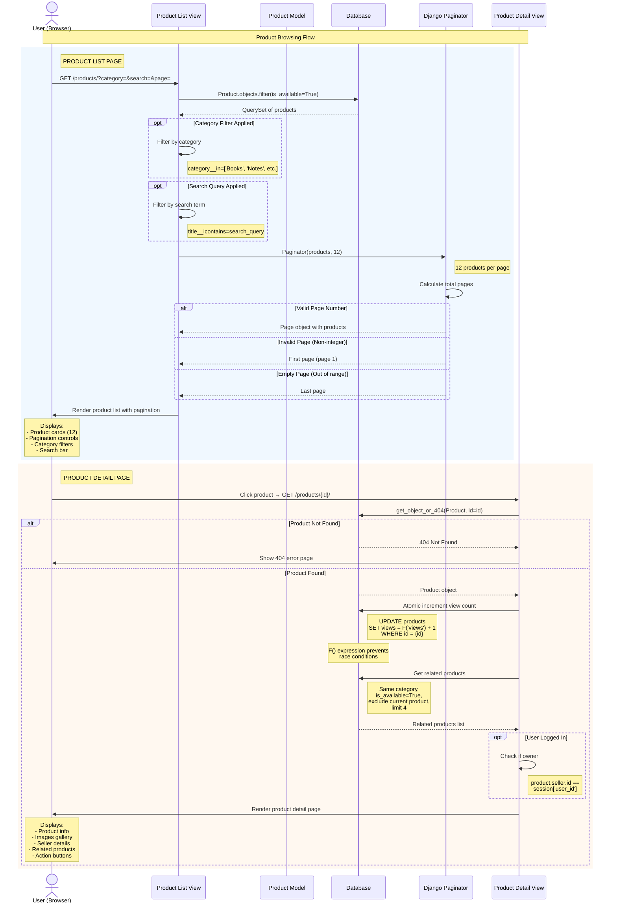

# Product Browsing Sequence Diagram

## Overview
This sequence diagram shows the product browsing workflow, including listing products with pagination, search/filter capabilities, and viewing product details with atomic view counter increments.

## Sequence Diagram

## Flow Description

### Actors and Participants

1. **User (Browser)** - Student browsing the marketplace
2. **Product List View** - View handling product listing (`products/views.py`)
3. **Product Model** - Django model for products
4. **Database** - SQLite database with product data
5. **Django Paginator** - Built-in pagination utility
6. **Product Detail View** - View handling individual product display

### Product List Flow

1. **Request with Parameters**
   - User navigates to `/products/`
   - Optional URL parameters:
     - `category` - Filter by category
     - `search` - Search query
     - `page` - Page number

2. **Database Query**
   - Base query: `Product.objects.filter(is_available=True)`
   - Only shows available products
   - Ordered by `-created_at` (newest first)

3. **Filtering**
   - **Category Filter**: If category parameter present:
     - `products.filter(category=category)`
   - **Search Filter**: If search query present:
     - `products.filter(title__icontains=search_query)`
     - Case-insensitive partial matching

4. **Pagination**
   - Django Paginator splits results into pages of 12
   - Handles edge cases:
     - Non-integer page → Returns page 1
     - Out of range → Returns last page
   - Preserves filters across pagination

5. **Render List**
   - Shows product cards with:
     - Product image (or emoji fallback)
     - Title, price, condition
     - Category badge
     - Seller info (limited if not logged in)

### Product Detail Flow

1. **Product Request**
   - User clicks product card
   - Navigates to `/products/{id}/`

2. **Product Lookup**
   - `get_object_or_404()` queries database
   - Returns 404 if product not found
   - Returns product object if found

3. **View Counter (Atomic)**
   - Uses Django's **F() expression** for atomic increment
   - `Product.objects.filter(pk=pk).update(views=F('views') + 1)`
   - **Race condition safe**: Prevents count loss from concurrent views
   - Increments directly in database without loading object

4. **Related Products**
   - Queries products with:
     - Same category
     - `is_available=True`
     - Excludes current product
     - Limits to 4 results

5. **Ownership Check**
   - If user logged in:
     - Compares `product.seller.id` with `session['user_id']`
     - Sets `is_owner` flag
   - Determines which buttons to show:
     - **Owner**: Edit/Delete buttons
     - **Other user**: Contact Seller button
     - **Anonymous**: Login prompt

6. **Render Detail**
   - Product information
   - Image gallery (up to 5 images)
   - Seller details (full if logged in, limited if anonymous)
   - Pricing and condition
   - Related products section
   - Action buttons based on ownership

## Key Features

- **Pagination**: 12 products per page with smart navigation
- **Filter Preservation**: Category and search maintained across pages
- **Atomic View Counter**: Race condition-safe using F() expressions
- **Privacy Control**: Limited seller info for anonymous users
- **Related Products**: Intelligent recommendations based on category
- **Ownership Detection**: Different UI for product owners
- **Search Functionality**: Case-insensitive title search
- **Category Filtering**: 5 categories (Books, Notes, Electronics, Stationery, Lab Equipment)

## Related Files

- [products/views.py](file:///d:/projects/mini%20project/products/views.py#L15-L51) - Product list view
- [products/views.py](file:///d:/projects/mini%20project/products/views.py#L53-L79) - Product detail view
- [products/models.py](file:///d:/projects/mini%20project/products/models.py) - Product model
- [products/templates/products/product_list.html](file:///d:/projects/mini%20project/products/templates/products) - List template
- [products/templates/products/product_detail.html](file:///d:/projects/mini%20project/products/templates/products) - Detail template
