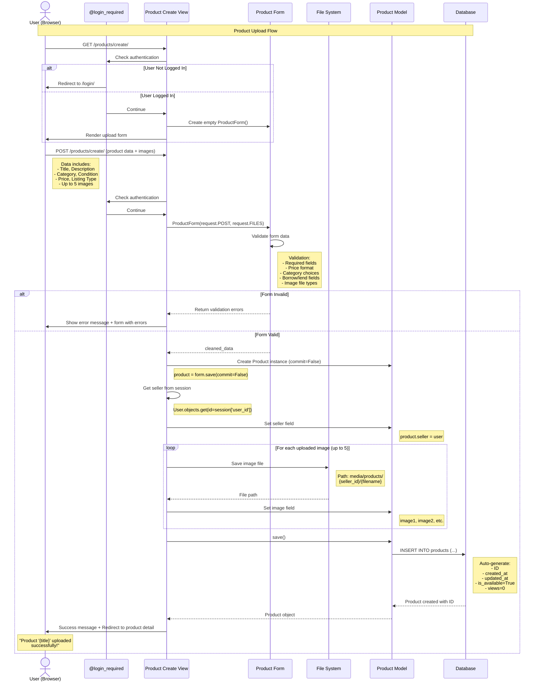

# Product Listing (Upload) Sequence Diagram

## Overview
This sequence diagram illustrates the product creation workflow, showing how users upload new products to the Student Resource Exchange marketplace, including image handling and database operations.

## Sequence Diagram

## Flow Description

### Actors and Participants

1. **User (Browser)** - Logged-in student uploading a product
2. **@login_required** - Decorator ensuring authentication
3. **Product Create View** - Django view handling product creation (`products/views.py`)
4. **Product Form** - Django form validating product data (`products/forms.py`)
5. **File System** - Local storage for product images
6. **Product Model** - Django model representing products
7. **Database** - SQLite database storing product records

### Main Flow Steps

1. **Authentication Check**
   - `@login_required` decorator intercepts request
   - If user not authenticated, redirects to login page
   - If authenticated, allows access to view

2. **Form Display (GET)**
   - View creates empty ProductForm
   - User sees form with fields:
     - Title, Description
     - Category (Books, Notes, Electronics, Stationery, Lab Equipment)
     - Condition (New, Like New, Good, Fair, Poor)
     - Listing Type (For Sale, For Lending, Both)
     - Price, Borrow pricing, Max borrow days
     - Up to 5 image uploads

3. **Form Submission (POST)**
   - User fills form and uploads images
   - Browser sends multipart/form-data request
   - `request.POST` contains text data
   - `request.FILES` contains uploaded images

4. **Validation**
   - Form validates all fields:
     - Required fields check
     - Price format validation
     - Category and condition choices
     - Image file type verification
     - Borrow/lend pricing logic

5. **Product Creation**
   - Form creates Product instance without saving
   - View retrieves current user from session
   - Sets seller field to current user

6. **Image Handling**
   - For each uploaded image (max 5):
     - File saved to: `media/products/{seller_id}/{filename}`
     - Path stored in `image1`, `image2`, etc. fields
   - Django automatically handles file upload

7. **Database Save**
   - Product model saved to database
   - Auto-generated fields:
     - Unique ID
     - `created_at` timestamp
     - `is_available = True`
     - `views = 0`

8. **Success Response**
   - Success message displayed
   - User redirected to product detail page
   - Product now visible in marketplace

## Key Features

- **Authentication Required**: Only logged-in users can upload products
- **Multi-Image Upload**: Support for up to 5 images per product
- **Automatic Path Management**: Images organized by seller ID
- **Flexible Listing Types**: Products can be for sale, lending, or both
- **Comprehensive Validation**: All fields validated before database save
- **Seller Association**: Products automatically linked to current user
- **Timestamp Tracking**: Automatic creation and update timestamps

## Related Files

- [products/views.py](file:///d:/projects/mini%20project/products/views.py#L82-L110) - Product create view
- [products/forms.py](file:///d:/projects/mini%20project/products/forms.py) - Product form validation
- [products/models.py](file:///d:/projects/mini%20project/products/models.py) - Product model with image fields
- [products/decorators.py](file:///d:/projects/mini%20project/products/decorators.py) - Login decorator
