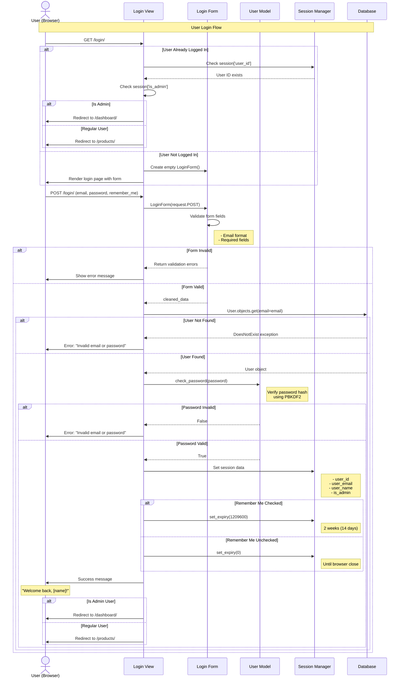

# User Login Sequence Diagram

## Overview
This sequence diagram shows the user authentication workflow in the Student Resource Exchange application, including password verification, session management, and role-based routing.

## Sequence Diagram

## Flow Description

### Actors and Participants

1. **User (Browser)** - The student logging into the application
2. **Login View** - Django view handling authentication (`login/views.py`)
3. **Login Form** - Django form validating credentials (`login/forms.py`)
4. **User Model** - Django model with password verification methods
5. **Session Manager** - Django session framework for state management
6. **Database** - SQLite database storing user records

### Main Flow Steps

1. **Initial Request (GET)**
   - User navigates to `/login/`
   - View checks if user already authenticated
   - If logged in, redirects based on role (admin → dashboard, user → products)
   - If not logged in, shows login form

2. **Credential Submission (POST)**
   - User enters email, password, and optionally checks "Remember Me"
   - Browser sends POST request with credentials

3. **Form Validation**
   - Form validates email format and required fields
   - If invalid, shows errors
   - If valid, proceeds to authentication

4. **User Lookup**
   - View queries database for user by email
   - If not found, shows generic error message (security: don't reveal if email exists)
   - If found, proceeds to password verification

5. **Password Verification**
   - User model's `check_password()` method verifies hash
   - Uses PBKDF2 algorithm with 260,000 iterations
   - Compares submitted password against stored hash

6. **Session Management**
   - On successful authentication, session data stored:
     - `user_id` - Unique user identifier
     - `user_email` - User's email address
     - `user_name` - Display name
     - `is_admin` - Admin privilege flag
   - Session expiry set based on "Remember Me" option:
     - **Checked**: 2 weeks (1,209,600 seconds)
     - **Unchecked**: Browser session (expires on close)

7. **Role-Based Redirect**
   - Admin users → `/dashboard/` (Admin Dashboard)
   - Regular users → `/products/` (Products Marketplace)

## Key Features

- **Session-Based Authentication**: Uses Django's session framework (no tokens/JWT)
- **Password Security**: PBKDF2 hashing with 260,000 iterations
- **Role-Based Access**: Separate routes for admin and regular users
- **Remember Me**: Optional extended session duration
- **Security**: Generic error messages don't reveal if email exists
- **Already Logged In Check**: Prevents re-login and redirects appropriately

## Related Files

- [login/views.py](file:///d:/projects/mini%20project/login/views.py) - Login and logout logic
- [login/forms.py](file:///d:/projects/mini%20project/login/forms.py) - Login form validation
- [registration/models.py](file:///d:/projects/mini%20project/registration/models.py) - User model with `check_password()` method
