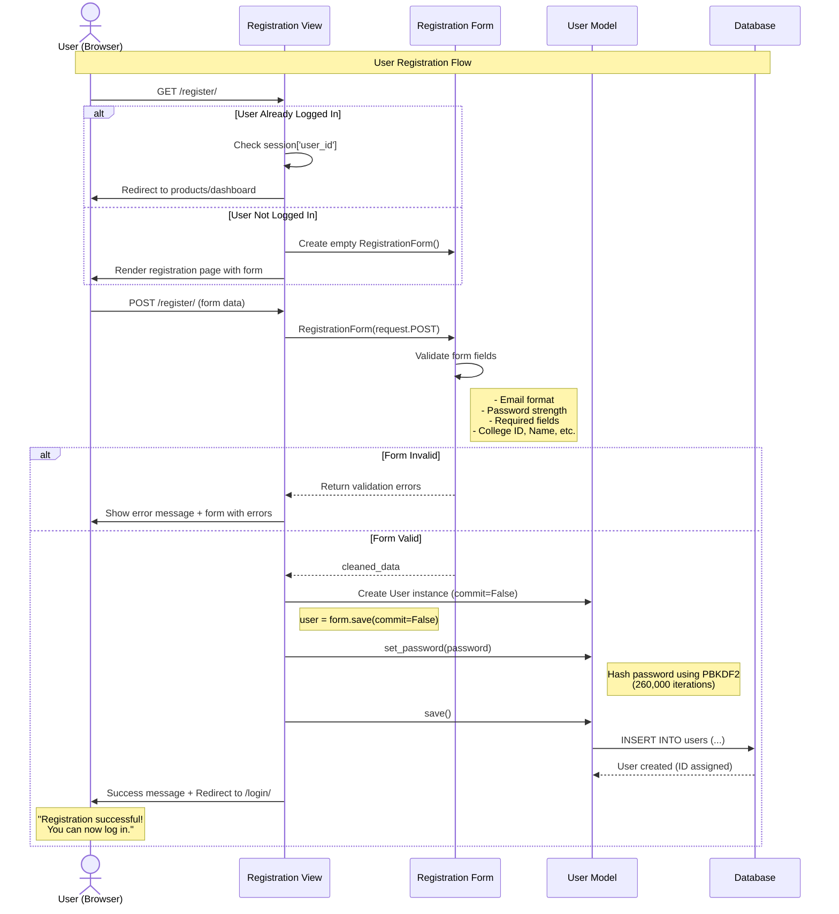

# User Registration Sequence Diagram

## Overview
This sequence diagram illustrates the user registration workflow in the Student Resource Exchange application, showing the interactions between the user's browser, Django views, forms, models, and the database.

## Sequence Diagram

## Flow Description

### Actors and Participants

1. **User (Browser)** - The student registering for an account
2. **Registration View** - Django view handling registration logic (`registration/views.py`)
3. **Registration Form** - Django form validating input data (`registration/forms.py`)
4. **User Model** - Django model representing user data (`registration/models.py`)
5. **Database** - SQLite database storing user records

### Main Flow Steps

1. **Initial Request (GET)**
   - User navigates to `/register/`
   - View checks if user already logged in via session
   - If logged in, redirects to appropriate page
   - If not logged in, renders registration form

2. **Form Submission (POST)**
   - User fills form with: email, password, name, college ID, college name, university name, address fields
   - Browser sends POST request to registration view

3. **Validation**
   - Form validates all fields (email format, required fields, etc.)
   - If invalid, returns errors to user
   - If valid, proceeds to user creation

4. **User Creation**
   - View creates User instance without saving (`commit=False`)
   - Password is hashed using `set_password()` method
   - PBKDF2 algorithm with 260,000 iterations for security

5. **Database Save**
   - User model saved to database
   - Database assigns unique ID
   - Success message displayed to user

6. **Redirect**
   - User redirected to login page
   - Can now log in with new credentials

## Key Features

- **Session Check**: Prevents already-logged-in users from registering again
- **Password Security**: Uses PBKDF2 hashing with 260,000 iterations
- **Validation**: Comprehensive form validation before database operation
- **Error Handling**: Clear error messages for invalid inputs
- **Success Flow**: Smooth redirect to login after successful registration

## Related Files

- [registration/views.py](file:///d:/projects/mini%20project/registration/views.py) - Registration view logic
- [registration/forms.py](file:///d:/projects/mini%20project/registration/forms.py) - Form validation
- [registration/models.py](file:///d:/projects/mini%20project/registration/models.py) - User model with 14 fields
